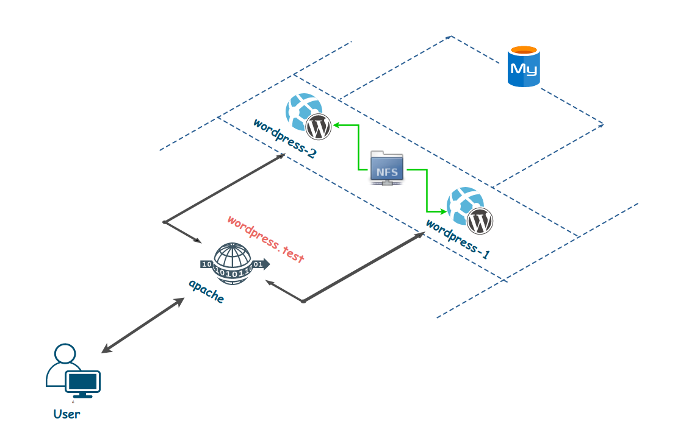
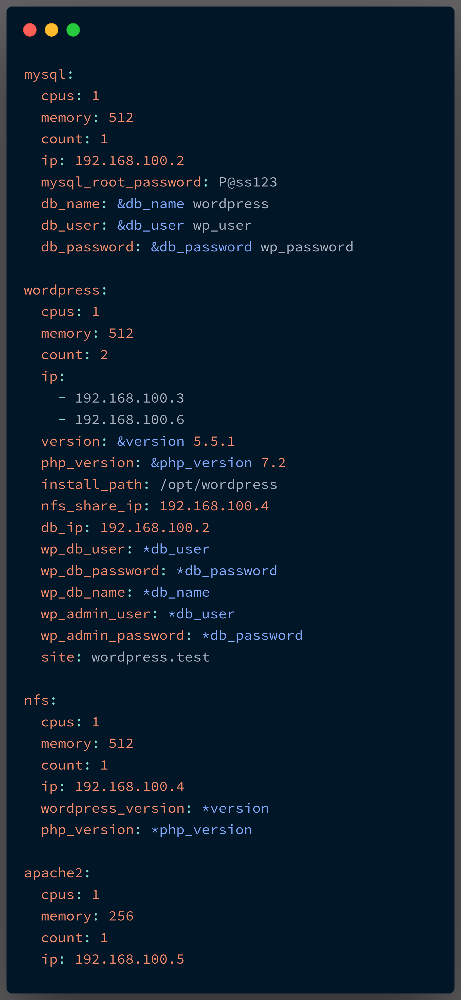

# Wordpress with Vagrant

## Stack 

The goal of this exercise is to deploy a highly available wordpress application using vagrant. 

The application stack is composed of : 
 - 1 Load Balancer called : **apache**
 - 2 Wordpress applications called : **wordpress-1** **wordpress-2**
 - 1 NFS share called : **nfs**
 - 1 Mysql database called: **mysql**

  

The stack should be configurable through a configuration file, let's call it : **config.yaml**. 

You can use the **config.yaml** found in the repo: 

  

The 2 wordpress applications will mount the wordpress folder into the following path : */opt/wordpress*

The wordpress folder should already be present on the NFS Share at the location : */mnt/wordpress*

If you are stuck at setting all the components, you can find all the necessary scripts to install & configure : 
  - Mysql 
  - Apache 
  - NFS Share
  - Wordpress 

in the **scripts** branch of the repo.

## Validate Your Solution 

To validate your implementation : 
 - Change the theme of your wordpress application 
 - Add some pages and content 
 - Stop one wordpress application 
 - Make sure that the website is always accessible and data is safe. 

## Copyright 
 - By Ayoub Ed-dafali
